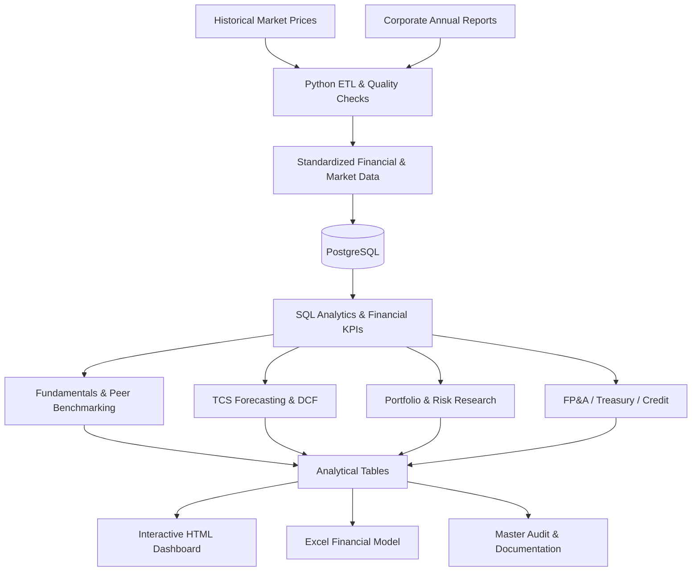

<div align="center">

<h1>FinSight 360</h1>

### Financial Intelligence · Equity Research · Valuation · Portfolio Risk

**An end-to-end financial analytics and investment research portfolio project**

**Built by Vivek Pandey**
B.Tech, Electronics & Communication Engineering · ITM University, Gwalior


**[Explore Dashboard](dashboard/FinSight_360_Interactive_Dashboard.html) · [Open Financial Model](excel/FinSight_360_TCS_Financial_Model_V2.xlsx) · [View Audit](results/tables/master_project_audit.csv) · [Read Methodology](docs/METHODOLOGY_AND_LIMITATIONS.md)**

</div>

---

## Executive Summary

**FinSight 360** is a financial intelligence and equity research platform that transforms historical market prices and corporate financial statements into analyst-ready datasets, company comparisons, valuation models, investment scenarios, portfolio risk analysis, and decision-support reports.

The project combines **Python ETL, PostgreSQL, SQL, financial modelling, Excel, and an interactive HTML dashboard**. Its primary research universe includes **Tata Consultancy Services (TCS), Infosys, and HCLTech**, with annual fundamentals spanning **FY2022–FY2026**. The TCS valuation workstream extends into **FY2027–FY2031** forecasts.

It was designed to demonstrate transferable capabilities for **Equity Research, Equity Valuation, Investment Research, Financial Analysis, FP&A, Portfolio Analysis, Market Risk, Treasury, Credit Analysis, and Data/Business Analytics** roles.

> **Project status:** Core implementation and local Git commit complete. The last reported master audit returned **53 PASS · 14 methodology warnings · 0 hard failures**. Warnings are documented limitations, not proof of independently verified investment-grade accuracy. The project is publicly available on GitHub.

## At a Glance

| Dimension | Coverage |
| :--- | :--- |
| **Companies** | TCS, Infosys, HCLTech |
| **Historical fundamentals** | FY2022–FY2026 |
| **Financial forecast** | TCS FY2027–FY2031 |
| **Valuation** | DCF, Bear/Base/Bull scenarios, P/E peer comparison, sensitivity analysis |
| **Investment analytics** | Market returns, portfolio strategies, risk metrics, stress testing |
| **Corporate finance** | FP&A variance analysis, treasury liquidity KPIs, internal credit scorecard |
| **Data engineering** | Python ETL, standardized datasets, PostgreSQL, SQL analytics |
| **Presentation** | Interactive HTML dashboard, Excel financial model, reporting CSVs |
| **Quality controls** | Master audit, reconciliation, documented modelling limitations |

## Contents

- [Business Questions](#business-questions)
- [System Architecture](#system-architecture)
- [Research & Analytics Modules](#research--analytics-modules)
- [Technology Stack](#technology-stack)
- [Featured Deliverables](#featured-deliverables)
- [Repository Structure](#repository-structure)
- [Local Setup & Usage](#local-setup--usage)
- [Data Integrity & Audit](#data-integrity--audit)
- [Methodology & Research Limitations](#methodology--research-limitations)
- [Analyst Roles & Skills](#analyst-roles--skills)
- [Author & Disclaimer](#author--disclaimer)

## Business Questions

1. **Fundamental performance:** How do TCS, Infosys, and HCLTech compare across earnings, profitability, financial position, and cash generation?
2. **Equity research:** How does a company's estimated intrinsic value change under different operating assumptions and discount rates?
3. **Relative valuation:** How do selected peer valuation measures compare, and where are data gaps material?
4. **Portfolio construction:** How do allocation choices affect portfolio-level risk, return measures, and concentration?
5. **Financial planning:** What do budget variances and liquidity measures reveal about financial performance and resilience?
6. **Data reliability:** How can source documents, relational tables, and automated checks support reproducible financial analysis?

## System Architecture



*This is a logical architecture. Individual scripts may read processed datasets directly rather than following every diagram edge.*

## Research & Analytics Modules

### 01 · Fundamental Analysis & Equity Research

- Structured **income statement, balance sheet, and cash-flow** data for three Indian IT companies.
- Cross-company financial KPI comparisons, ratio analysis, and **DuPont analysis**.
- Explicit attention to consolidated versus parent-attributable income and equity definitions.
- Missing source line items are treated as **unavailable**, not silently replaced with zero.

### 02 · Financial Forecasting & Equity Valuation

- **TCS FY2027–FY2031** forecast and scenario outputs.
- **Discounted Cash Flow (DCF)** modelling with Bear, Base, and Bull cases.
- Equity-value and per-share sensitivity to key modelling assumptions.
- **P/E-based relative valuation** for selected peers.
- Clear separation between historical FCF and projected **FCFF**.

**Research caution:** The DCF currently uses a **12.25% WACC modelling assumption**. Terminal growth, financial-asset adjustments, lease treatment, and valuation timing require judgement; see [Methodology & Research Limitations](#methodology--research-limitations).

### 03 · Portfolio Analytics & Risk

- Comparison of portfolio allocation strategies.
- Return and risk measures, including Sharpe and Sortino-style metrics.
- Portfolio stress scenarios and concentration analysis.
- Identification of a **highly HCLTech-concentrated** maximum-Sharpe result as a material risk consideration.

*The reported Sharpe/Sortino methodology uses a 0% risk-free baseline; results are analytical illustrations, not trading recommendations.*

### 04 · FP&A & Corporate Finance

- Budget-versus-actual analysis and variance reporting.
- Treasury liquidity indicators and financial monitoring.
- An **internal analytical credit scorecard** to demonstrate financial risk assessment concepts.

*The internal score is not an external credit rating, a calibrated default probability, or an agency opinion.*

### 05 · Data Engineering, Reporting & Audit

- Python extraction, transformation, normalization, and validation.
- PostgreSQL relational storage and SQL-based financial analysis.
- Exported research tables feeding a final **interactive HTML dashboard** and **Excel financial model**.
- Master audit for selected structural, mathematical, and deliverable checks.

## Technology Stack

| Layer | Tools / Techniques | Purpose |
| :--- | :--- | :--- |
| Programming | Python, Pandas, NumPy | ETL, transformations, financial analytics |
| Data storage | PostgreSQL, SQLAlchemy | Financial periods, statements, market data |
| Querying | SQL | Joins, aggregations, financial KPIs |
| Research | DCF, financial ratios, scenario analysis | Valuation and fundamental analysis |
| Portfolio analytics | Returns, risk metrics, stress scenarios | Allocation and risk research |
| Spreadsheet | Microsoft Excel | Analyst-oriented financial model |
| Visualization | HTML dashboard | Interactive presentation |
| Engineering workflow | Git, audit scripts | Versioning and quality checks |

See [`requirements.txt`](requirements.txt) for the project's dependency list.

## Featured Deliverables

### Interactive Financial Intelligence Dashboard

**[Open the HTML dashboard source](dashboard/FinSight_360_Interactive_Dashboard.html)**

The dashboard brings together the project's financial and analytical reporting in a browser-based interface. Download/open the HTML file locally if your GitHub browser does not render it as an interactive application.

### TCS Financial Model

**[Download the Excel financial model](excel/FinSight_360_TCS_Financial_Model_V2.xlsx)**

A spreadsheet-oriented view of the TCS financial modelling and valuation workstream. Review formulas and assumptions in Excel before interpreting estimates.

### Research Output Library

| Analysis | Output |
| :--- | :--- |
| DCF equity valuation | [Final equity valuation](results/tables/tcs_dcf_final_equity_valuation.csv) |
| DCF sensitivities | [Per-share sensitivity](results/tables/tcs_dcf_per_share_sensitivity.csv) |
| Financial forecast | [FY2027–FY2031 scenarios](results/tables/tcs_scenario_forecast_FY2027_FY2031.csv) |
| Peer valuation | [FY2026 peer relative valuation](results/tables/fy2026_peer_relative_valuation.csv) |
| Portfolio strategies | [Strategy summary](results/tables/portfolio_strategy_summary.csv) |
| Portfolio risk | [Risk metrics](results/tables/portfolio_risk_metrics.csv) |
| Stress analysis | [Stress tests](results/tables/portfolio_stress_tests.csv) |
| FP&A | [Budget variance](results/tables/tcs_fpa_budget_variance.csv) |
| Treasury | [Liquidity KPIs](results/tables/tcs_treasury_liquidity_kpis.csv) |
| Credit analytics | [Internal scorecard](results/tables/tcs_credit_scorecard.csv) |
| Quality assurance | [Master audit report](results/tables/master_project_audit.csv) |

## Repository Structure

```text
FinSight-360/
├── config/                 # Research universe and project settings
├── data/
│   ├── raw/                # Source material (some files may be Git-ignored)
│   ├── interim/            # Standardized financial statement data
│   └── processed/          # Prepared analytical datasets
├── dashboard/
│   └── FinSight_360_Interactive_Dashboard.html
├── docs/
│   └── METHODOLOGY_AND_LIMITATIONS.md
├── excel/
│   └── FinSight_360_TCS_Financial_Model_V2.xlsx
├── python/
│   ├── analysis/           # Valuation, analytics and audit
│   ├── etl/                # Extraction and database loading
│   └── utils/              # Shared database utilities
├── results/
│   └── tables/             # Financial and research outputs
├── sql/                    # Database schema and analytics SQL
├── requirements.txt
└── README.md
```

*This is a simplified logical layout; the exact tracked contents can be inspected in Git.*

## Local Setup & Usage

**Prerequisites:** Python 3.11-compatible environment, PostgreSQL, access to the required source data, and a local database configuration. Do not commit `.env` files, passwords, or private credentials.

```powershell
# Clone after publication; replace vivekpandey11 with the actual GitHub handle
# git clone https://github.com/vivekpandey11/FinSight-360.git

cd FinSight-360
python -m venv .venv
.\.venv\Scripts\Activate.ps1
pip install -r requirements.txt

# Run audit after the required data and database have been configured
python python\analysis\master_project_audit.py

# View final outputs on Windows
Start-Process .\dashboard\FinSight_360_Interactive_Dashboard.html
Start-Process .\excel\FinSight_360_TCS_Financial_Model_V2.xlsx
```

**Reproducibility note:** This is **not** advertised as a one-command full rebuild. Some raw annual reports and local datasets may be excluded from the public repository. Database initialization and ETL execution require the correct input files and configuration; inspect loader scripts before re-running them because some replace existing database rows.

## Data Integrity & Audit

The last locally reported master audit produced:

| Check outcome | Count |
| :--- | ---: |
| **PASS** | **53** |
| **WARNING** | **14** |
| **FAIL** | **0** |

**[Inspect the audit script](python/analysis/master_project_audit.py)** · **[Inspect the audit output](results/tables/master_project_audit.csv)**

**Example source-to-database reconciliation — HCLTech FY2024 (₹ crore):**

| Field | Reconciled amount |
| :--- | ---: |
| Operating cash flow | 22,448 |
| Investing cash flow | −6,723 |
| Financing cash flow | −15,464 |
| Depreciation & amortization | 4,173 |
| Capital expenditure | 1,048 |
| Dividends paid | 14,073 |
| Historical FCF = CFO − CapEx | 21,400 |

These figures were reconciled during local project finalization against the standardized CSV, PostgreSQL, and available source-report lines. Some other HCLTech statement fields remain unstandardized. **The audit is not an independent external financial audit.** The current audit report may still contain older wording about the financing cash-flow reconciliation; that specific CSV/database comparison has subsequently been completed.

## Methodology & Research Limitations

The complete disclosure is in **[Methodology and Limitations](docs/METHODOLOGY_AND_LIMITATIONS.md)**. Important considerations include:

- **Financial attribution:** Consolidated PAT versus profit attributable to owners, and total equity versus parent shareholders' equity, require consistent definitions.
- **Valuation assumptions:** WACC and terminal growth are research assumptions, not management guidance or independently verified market inputs.
- **DCF equity bridge:** Excess financial assets, debt, and lease liabilities require consistent treatment with the FCFF definition.
- **Timing:** The FY2026 model anchor differs from the **6 October 2026** market-price reference date.
- **Cash-flow terminology:** Historical FCF is not interchangeable with projected FCFF.
- **Peer valuation:** EV/EBITDA is intentionally omitted where standardized net debt and share data are insufficient.
- **Portfolio interpretation:** A 0% risk-free assumption and high single-stock concentration affect risk-adjusted metrics.
- **Credit scoring:** The internal 98% score is a project-specific indicator, not an external rating or calibrated probability.
- **Coverage gaps:** Some standardized HCLTech financial statement line items remain missing.

## Analyst Roles & Skills

| Career direction | Demonstrated capabilities |
| :--- | :--- |
| **Equity Research / Equity Valuation** | Fundamental analysis, DCF, peer comparison, sensitivity and scenario analysis |
| **Investment Research / Investment Analyst** | Financial forecasting, valuation assumptions, investment scenario research |
| **Financial Analyst / FP&A** | Statement analysis, budgeting, variance analysis, liquidity monitoring |
| **Portfolio Analyst / Market Risk** | Portfolio comparisons, concentration analysis, risk metrics, stress testing |
| **Treasury / Credit Analyst** | Liquidity KPIs, internal scorecard, financial risk concepts |
| **Data Analyst / Business Analyst** | Python, SQL, PostgreSQL, data modelling, KPIs, audit, dashboard reporting |

This is a **portfolio project**, not professional employment experience. Dedicated quant trading, execution, product experimentation, and supply-chain modelling are outside its scope.

## Author & Disclaimer

**Vivek Pandey**
B.Tech — Electronics & Communication Engineering
ITM University, Gwalior, India

**Project:** FinSight 360 — Financial Intelligence, Equity Valuation & Portfolio Risk Research Platform

> **Disclaimer:** This repository is an educational, independently developed portfolio demonstration. It does not constitute investment advice, a buy/sell recommendation, a regulated credit rating, or a guarantee of investment performance. Forecasts, scenarios, and valuation estimates depend on assumptions and incomplete or historical data. Company names and source documents belong to their respective owners.

---

<div align="center">

**From raw financial data to structured research, valuation, risk analysis, and decision-ready reporting.**

*Developed by Vivek Pandey · FinSight 360*

</div>
